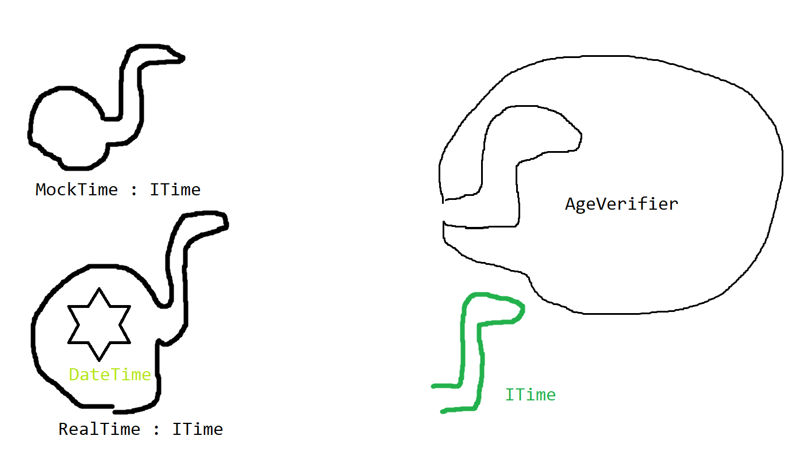

# (lite mer) Avancerad testing

Förra veckan så testade vi bara "enkel" C# kod.
Strängmanipulering, if-satser, for-loopar, osv.

Så länge du inte använder `static` i din klass
så är det nästan garanterat att testerna du skriver
blir enhetstester, oberoende av varandra och av körordning.

Vi kommer att se om man testar något som använder
tid, långvarig lagring eller slump så blir det
inte lika självklart att ens tester är enhetstester.

### Innehåll
- [En klass som kollar ålder](#en-klass-som-kollar-alder)
- [Interfaces](#interfaces)
- [Tillbaka till åldrar](#tillbaka-till-aldrar)
- [Att bygga en almenacka](#att-bygga-en-almenacka)
- [Kontrollera slump](#kontrollera-slump)

## Var ska vi använda `var`?

## En klass som kollar ålder
Använd `AgeVerifier` och `Person` och skriv i `AgeVerifierTests.cs`
### Kata
1. Skriv ett test som kollar att någon 
    som är för ung inte blir godkänd
2. Skriv ett test som kollar att någon 
    som är gammal nog blir godkänd
3. Skriv ett test som kollar att någon
    först kan vara för ung, men ett år senare
    blir gammal nog

## Interfaces
Interfaces är till för att tillåta flera
lösningar under ett gemensamt gränssnitt.

### Syntax:
```csharp
interface IPayer
{
    public bool TryMakePayment(int amount);
}
```
* `interface` används istället för `class`
* Alla medlemmar måste vara `public`
* Istället för metodkroppar (`{}`) används `;`
* Används genom att sätta den på en klass
  ```csharp
    class DebitCard : IPayer
    {
        public bool TryMakePayment(int amount)
        {
            //...
        }
    }
  ```

### Kata

1. Skriv en klass som använder `IPayer` och simulerar
    ett debit kort
2. Skriv en klass som använder `IPayer` och simulerar
    ett kreditkort
2. Skriv en klass som använder `IPayer` och simulerar
    ett en plånbok med flera olika kort i (`List<IPayer>`)

## Tillbaka till åldrar

Tillbaka till där vi var.

> 3. Skriv ett test som kollar att någon
    först kan vara för ung, men ett år senare
    blir gammal nog

Istället för att använda `DateTime.Now` så kan
vi använda en interface som tillåter två lösningar.

1. `RealTime` klassen som använder `DateTime.Now`
2. `MockTime` klassen som använder en fast tid
    som vi kan ändra på vid behag

### Kata
1. Skapa en `ITime` interface som har en property
    eller en metod som returnerar en `DateTime`
2. Skapa en `MockTime` klass som har en extra
   metod där vi kan ändra vad som är "nu" (`public void SetNowTo(DateTime date)`)
3. Skicka med `MockTime` testet till lösningen
    testa att personen först är för ung, sen vrid
    fram klockan ett år och se att personen nu
    är gammal nog
4. Skapa ett test som kollar att `RealTime`
    klassen finns och visar samma som DateTime.Now

När koden väl används i produktionskod senare
så är det bara att skicka med `RealTime`
till konstruktorn istället för `MockTime`



---
#### 🍔 Lektions break 🍔
---

## Att bygga en almenacka

När det kommer till att lagra filer brukar
man ta till ett liknande trick, ofta kallat
`IStore`. En `IStore` ansvarar för att spara
ner och hämta data. Låt säga att denna `IStore`
har en `public List<Appointment> Load()` och en
`public Save(List<Appointment> todos)`.

### Verktyg för att jobba med filer
- `Environment.GetFolderPath(Environment.SpecialFolder.UserProfile)` för att få tag på vanliga foldrar
- `Path.Combine()` för att bygga nya filsystems adresser
- `File.Exists()` för att kolla om en fil redan finns
- `StreamReader` för att läsa av en fil
- `StreamWriter` för att skriva till en fil

### Kata
1. Skapa ett test med en `Schedule` klass som har
    en metod `AddAppointment(string what, DateTime when)`
2. Skapa ett test där man kan få tag på två listor
    `List<Appointment> GetActiveAppointments()` och
    `List<Appointment> GetFinishedAppointments()`
3. Skapa ett test där I act steget så skapas `Schedule`, 
    fylls och sen skrivs över med en ny
    `Schedule` men denna gången ska det nya `Schedule` 
    objektet innehålla samma schematider som tidigare.
    Använd en `InMemoryStore` (`IStore`) 
    som bara sparar listan i ett fält vid `Save` och sen lämnar
    tillbaka den vid `Load`, för att 
3. Skapa en `FileStore` klass som kan spara ner
    en `List<Appointment>` till given plats (via konstruktor).
    Asserta filen och dess innehåll. Ladda sen filen
    och asserta att listan är samma som listan vi
    började med.

Nu är det smidigt att skriva tester som inte
krockar med varandra, samtidigt så har vi en
`FileStore` klass som kan användas i 
produktionskod när det behövs.

Om vi är oroliga för att något skulle gå snett
om vi sparar en massa listor samtidigt så kan man
bara skriva fler tester som testar `FileStore`
i mer extrema situationer.

## Kontrollera slump

Principen är den samma för att styra slumpen.
Man skapar en interface för att wrappa `Random`
klassen och sen bygger en `MockRandom` där man
kan t.ex. styra vilken seed som används, och hämta
ut vilka tal som dök upp.

### Bonus Kata (klurig)
Målet är att skriva ett program som kan rulla
och summera olika tärningskombinationer.

1. Skriv ett test där man rullar strängen "3d6" 
    och ska få en viss summa
2. Använd en `MockRandom` som dels sätter seed,
    men dels också returnerar en lista med alla
    resultat som du sen summerar och använder som svar
2. Utöka med ett nytt test så att man kan rulla 
    t.ex. "5d8 2d3 3d12" i en omgång